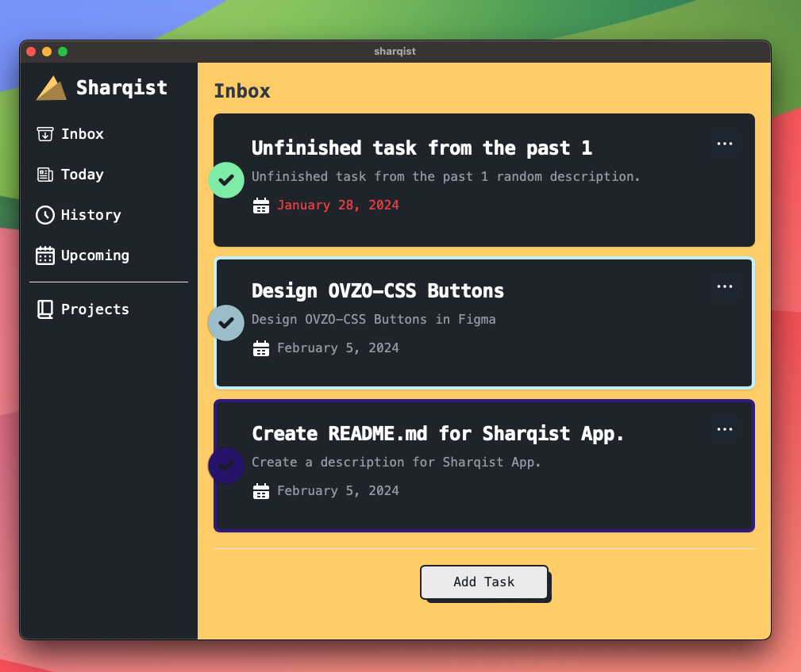
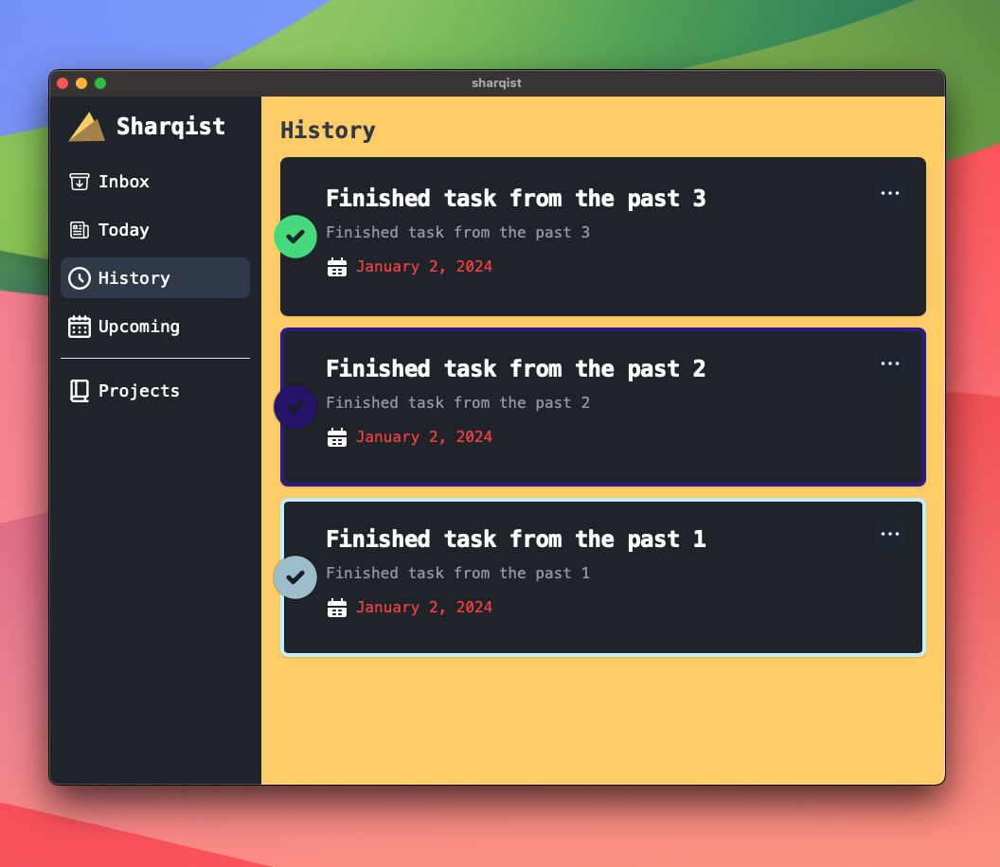
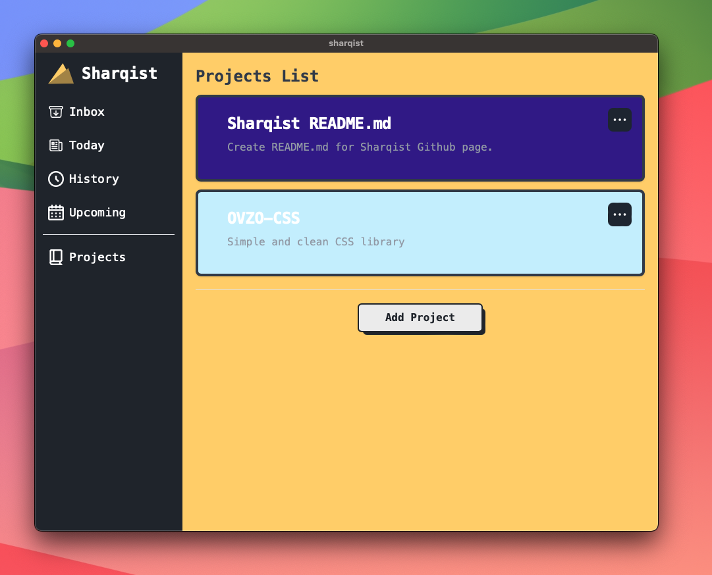

# Sharqist

The inspiration behind creating this tool stemmed from my tendency to overlook adding completed features and tasks to my timesheet, leading to significant time spent at the end of each month trying to recall my activities. Additionally, I sought a solution that would provide a checklist to ensure that my current code adheres to best practices.

Introducing Sharqist, the ideal task management tool designed specifically for programmers in their workplace. It not only assists in organizing tasks and tracking their history but also promotes adherence to clean code practices, facilitates the maintenance of a tidy Git history, supports the creation of pristine merge requests, and ensures the security of web applications.

### Technology

For the implementation of Sharqist, I opted for Tauri. This decision was driven by my desire to initiate my acquaintance with Rust, a technology I am actively cultivating expertise in as part of my journey into blockchain development.

# Manage your tasks at work.

Simplify task management with Sharqist, offering seamless organization with the ability to add dates and categories to your tasks, while meticulously tracking your task history.

### Today

Effortlessly handle tasks assigned for the day.


## Inbox

Effectively oversee all incomplete tasks due today or earlier.



## History

Monitor completed tasks and track your progress over time.
</br> (So you can put easily the tasks into a timesheet)



## Upcoming

Keep track of your future tasks and plan your work ahead of time.
</br> (This allows you to easily organize and prioritize your tasks)


## Projects

Structure your tasks by grouping them into projects. This feature streamlines the management of related tasks, enhancing overall work efficiency.



##### Ongoing Clean Code Checklist

Adopt best practices for crafting clean, maintainable code. Sharqist presents a comprehensive checklist to guide you in adhering to clean code principles.

##### Ongoing Design Patterns Checklist

Optimize code structure with proven design patterns. Sharqist provides a checklist of common design patterns, empowering you to write efficient and maintainable code.

##### Ongoing Clean Git Checklist

Preserve a pristine Git history. Sharqist offers a checklist to assist you in following Git's best practices.

##### Ongoing Clean Merge Request Checklist

Craft impeccable merge requests. Sharqist provides a checklist, ensuring your merge requests are clear, well-structured, and easy to review.

##### Ongoing (OWASP) Security Checklist

Safeguard your web applications. Sharqist incorporates a checklist based on OWASP (Open Web Application Security Project) guidelines, guiding you to build secure web applications.

Ensure the security of your web applications. Sharqist provides a checklist based on the OWASP (Open Web Application Security Project) guidelines to help you build secure web applications.

### Getting Started

To get started with Sharqist, clone the repository, install the dependencies, and start the application:

```bash
git clone https://github.com/yourusername/sharqist.git
cd sharqist
npm install
npx tauri dev
```

or

```bash
git clone https://github.com/yourusername/sharqist.git
cd sharqist
npm install
npx tauri build
```

and open the contents of the Sharqist in the Finder, then open the MacOS directory and run the app!

### 🎉 Enjoy using Sharqist! 🎉
